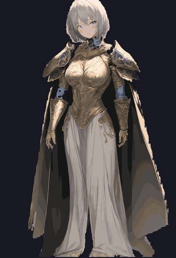

# img2rig

**Turn a single AI-generated illustration into a breathing, layered character
rig — fully agent-driven.**

[](https://pypi.org/project/img2rig/)
[](https://www.npmjs.com/package/img2rig)
[](LICENSE)

<p align="center">
  
  
  <br>
  <em>Mira, the bundled demo character: one txt2img illustration → 13 layers → idle / hit / stagger / enrage,
  all procedural. Try it without installing anything GPU-side:
  <code>img2rig preview --spec examples/mira/mira.yaml</code>, or interactively in the browser via
  <code>runtime/web/</code></em>
</p>

One text prompt in; out comes a character that breathes, blinks, sways her
hair on spring physics, staggers when hit, and swings full-frame attack
keyframes — with **zero manual rigging and zero manual mask painting**. The
pipeline replaces both the rigger and the cleanup artist with an LLM agent
running a visual loop over local models (Stable Diffusion + GroundingDINO +
SAM), and the runtime is two dependency-free C++ headers.

```
prompt ──> [1] generate ──> [2] variants ──> [3] split ──> [4] cleanup ──> [5] export ──> [6] runtime
            txt2img            img2img         DINO+SAM      agent loop      layer PNGs     springs,
            candidates         states &        text masks    point tables,   + rig.txt      breath,
            + contact          pose            + PSD         inpaint, QA                    blinks,
            sheets             keyframes                     sheets                         strikes
```

## Why this exists

- **Battle-grade 2D character rigging has no production-level automation** —
  mesh-deformation tools are manual by design. But most of what makes a
  character feel alive on screen (timing, physical lag, impact) doesn't need
  mesh warping: rigid layers + springs + full-frame pose keyframes cover it,
  and *that* pipeline automates end to end.
- **The "manual cleanup" in AI layer separation is really two jobs** — the
  clicker (interactive segmentation prompts) and the QA eye. Both are visual
  judgment loops, and an agent with vision runs them: look at the probe →
  edit the point table → rerun → look at the overlay. This repo is that loop,
  made reproducible: all state in one YAML spec, all observations on disk as
  images. See [docs/agent-playbook.md](docs/agent-playbook.md).

## Quickstart

Requirements: Python ≥ 3.10, a local
[AUTOMATIC1111-compatible WebUI](https://github.com/AUTOMATIC1111/stable-diffusion-webui)
with `--api`, and the
[sd-webui-segment-anything](https://github.com/continue-revolution/sd-webui-segment-anything)
extension (SAM + GroundingDINO). **Bring your own model weights** — none are
distributed here, and the pipeline is checkpoint-agnostic (tag-trained anime
checkpoints respond best to the example prompt templates).

```bash
pip install img2rig[psd]                 # or: pip install -e .[psd] from a checkout
cp examples/character.yaml mychar.yaml   # edit prompts; point tables come later
img2rig gen --spec mychar.yaml           # roll candidates + contact sheet
# ... follow the stage flow in docs/pipeline.md, or hand the wheel to an
#     agent with skill/img2rig-pipeline/SKILL.md
```

The runtime is header-only — drop `runtime/cpp/img2rig/` into your include
path, implement one draw-a-rotated-quad callback, and:

```cpp
img2rig::RigPlayer rig;
rig.load("assets/mychar/rig.txt");
rig.update(dt);                                  // world dt: freeze time, freeze her
rig.draw(myDrawFn, {x, y}, displayHeight);
rig.trigger(img2rig::Motion::Stagger);           // procedural, never locks game timing
rig.strikeWindup(img2rig::StrikeStyle::Smash, false, true);
```

Runtime tests: `cmake -S runtime/cpp -B build && cmake --build build && ctest`.

## Repository layout

| Path | What |
|---|---|
| `src/img2rig/` | Python pipeline (config-driven, one CLI) |
| `examples/character.yaml` | the spec schema — prompts, part tables, SAM point tables, rig tree |
| `examples/mira/` | complete demo character: iterated spec + exported 13-layer rig pack (CC0), renders offline via `img2rig preview` |
| `runtime/cpp/img2rig/` | `rig_math.h` (parse/springs/solve, unit-tested) + `rig_player.h` (motion state machine, renderer-agnostic) |
| `runtime/web/` | dependency-free canvas player (ES module) — `python -m http.server` at the repo root, open `/runtime/web/`, click the motion buttons |
| `docs/` | [pipeline](docs/pipeline.md) · [rig format](docs/rig-format.md) · [agent playbook](docs/agent-playbook.md) |
| `skill/img2rig-pipeline/` | drop-in skill for Claude Code agents operating the pipeline |

## Scope & honest limitations

- Rigid layers + springs, **no mesh deformation**: breathing chest bulge and
  bending hair arcs are approximated, not simulated. The big pose reads use
  full-frame keyframe swaps (fighting-game style) because a cutout rig can
  never exceed what the source illustration contains.
- The segmentation point tables are per-character. The *structure* transfers;
  the coordinates are re-derived each time (that's the agent's job, ~4–6
  visual-loop rounds per character in practice).

## License & trademarks

Apache-2.0 — see [LICENSE](LICENSE) and [NOTICE](NOTICE).

img2rig is not affiliated with, endorsed by, or derived from Live2D Inc.'s
products; "Live2D" is a trademark of Live2D Inc., and this project contains
no Live2D SDK code and produces no Live2D-format assets. Stable Diffusion
WebUI, GroundingDINO and SAM are separate projects under their own licenses;
img2rig talks to them only over their local HTTP APIs and redistributes no
model weights. You are responsible for complying with the license of whatever
checkpoint you generate with.
